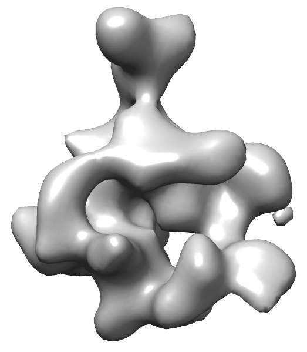

Stage 1 - Gathering of data {#rnapolii_1}
===========================

In this stage, we find all available experimental data that we wish to utilize in structural modeling.  In theory, any method that provides information about absolute or relative structural information can be used.  A non-exhaustive list of data types currently supported in %IMP is:

* [Solution X-ray Scattering (SAXS)](@ref IMP::saxs)
* [Cysteine cross-linking](@ref IMP::isd::CysteineCrossLinkRestraint)
* [Chemical cross-linking](@ref IMP::isd::CrossLinkMSRestraint)
* Electron Microscopy ([2D class averages](@ref IMP::em2d)
  or [3D maps](@ref IMP::em))
* [FRET](@ref IMP::isd::FretRestraint)
* NMR Restraints (CSP, [NOE](@ref IMP::isd::NOERestraint), J-couplings)
* [Immunoprecipitation pull-down](@ref IMP::core::ConnectivityRestraint)
* [Atomic resolution structures](@ref IMP::atom) (PDB, RMF from experimental data or homology modeling)

## Data for yeast RNA Polymerase II
The `rnapolii/data` folder in the tutorial input files contains the data included in this example:

* Sequence information (FASTA files for each subunit)
* [Electron density maps](http://www.ebi.ac.uk/pdbe/entry/EMD-1883/visualization) (`.mrc`, `.txt` files)
* [High resolution structure from x-ray crystallography](http://www.rcsb.org/pdb/explore/explore.do?structureId=1WCM) (PDB file)
* Chemical crosslinking datasets (we use two data sets, one from [Al Burlingame's lab](http://www.mcponline.org/content/13/2/420.long), and another from [Juri Rappsilber's lab](http://emboj.embopress.org/content/29/4/717))

**FASTA File**  
Each residue included in modeling must be explicitly defined in the FASTA text file.  Each individual component (i.e., a protein chain) is identified by a string in the FASTA header line.  From `1WCM.fasta.txt`:

    >1WCM:A
    MVGQQYSSAPLRTVKEVQFGLFSPEEVRAISVAKIRFPETMDETQTRAKIGGLNDPRLGSIDRNLKCQTCQEGMNECPGH
    FGHIDLAKPVFHVGFIAKIKKVCECVCMHCGKLLLDEHNELMRQALAIKDSKKRFAAIWTLCKTKMVCETDVPSEDDPTQ  
    ...

    >1WCM:B
    MSDLANSEKYYDEDPYGFEDESAPITAEDSWAVISAFFREKGLVSQQLDSFNQFVDYTLQDIICEDSTLILEQLAQHTTE
    SDNISRKYEISFGKIYVTKPMVNESDGVTHALYPQEARLRNLTYSSGLFVDVKKRTYEAIDVPGRELKYELIAEESEDDS  
    ...

defines two chains with unique IDs of 1WCM:A and 1WCM:B respectively.  The entire complex is 12 chains and 4582 residues.

**Electron Density Map**  
The electron density map of the entire RNA Poly II complex is at 20.9 Angstrom resolution.  The raw data file for this is stored in `emd_1883.map.mrc`.

_Electron microscopy density map for yeast RNA Polymerase II_

**Electron Density as Gaussian Mixture Models**  
Gaussian mixture models (GMMs) are used to greatly speed up scoring by approximating the electron density of individual subunits and experimental EM maps.  A GMM has been created for the experimental density map, and is stored in `emd_1883.map.mrc.gmm.50.mrc`.  The weight, center, and covariance matrix of each Gaussian used to approximate the original EM density can be seen in the corresponding `.txt` file.  

_The EM data represented as a 50 Gaussian mixture model_

**PDB File**  
High resolution coordinates for all 12 chains of RNA Pol II are found in `1WCM.pdb`.  

_Coordinates from PDBID [1WCM](http://www.rcsb.org/pdb/explore.do?structureId=1wcm)_

**Chemical Cross-Links**  
All chemical cross-linking data is located in `polii_xlinks.csv` and `polii_juri.csv`.  These files contain multiple comma-separated columns; four of these specify the protein and residue number for each of the two linker residues.

    prot1,res1,prot2,res2
    Rpb1,34,Rpb1,49
    Rpb1,101,Rpb1,143
    Rpb1,101,Rpb1,176

The length of the DSS/BS3 cross-linker reagent, 21 angstroms, will be specified later in the modeling script.  

---

With data gathered, we can now proceed to \ref rnapolii_2.
