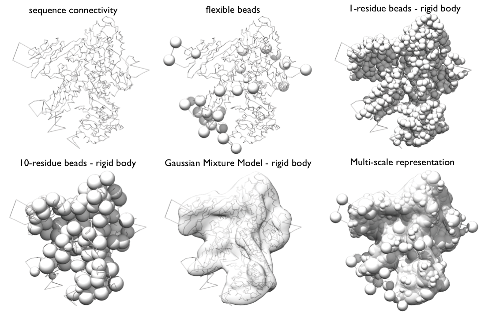

Stage 2 - Representation of subunits and translation of the data into spatial restraints {#rnapolii_2}
========================================================================================

In this stage, we will initially define a representation of the system. Afterwards, we will convert the data into spatial restraints.  This is performed using the script `rnapolii/modeling/modeling.py` and uses the
[topology file](@ref IMP::pmi::topology::TopologyReader),
`topology.txt`, to define the system components and their representation
parameters.

### Setting up Model Representation in IMP

**Representation** 
Very generally, the *representation* of a system is defined by all the variables that need to be determined based on input information, including the assignment of the system components to geometric objects (e.g. points, spheres, ellipsoids, and 3D Gaussian density functions). 

Our RNA Pol II representation employs *spherical beads* of varying sizes and *3D Gaussians*, which coarsen domains of the complex using several resolution scales simultaneously. The *spatial restraints* will be applied to individual resolution scales as appropriate. 

Beads and Gaussians of a given domain are arranged into either a rigid body or a flexible string, based on the crystallographic structures. In a *rigid body*, all the beads and the Gaussians of a given domain have their relative distances constrained during configurational sampling, while in a *flexible string* the beads and the Gaussians are restrained by the sequence connectivity. 

_Multi-scale representation of Rpb1 subunit of RNA Pol II_

The GMM of a subunit is the set of all 3D Gaussians used to represent it; it will be used to calculate the EM score. The calculation of the GMM of a subunit can be done automatically in the
[topology file](@ref IMP::pmi::topology::TopologyReader).
For the purposes of this tutorial, we already created these for Rpb4 and Rpb7 and placed them in the `rnapolii/data` directory in their respective `.mrc` and `.txt` files. 

**Dissecting the script**
The script `rnapolii/modeling/modeling.py` sets up the representation of the system and the restraint. (Subsequently it also performs [sampling](@ref rnapolii_3), but more on that later.)

**Header**  
The first part of the script defines the files used in model building and restraint generation.

\code{.py}
#---------------------------
# Set up Input Files
#---------------------------
datadirectory = "../data/"
topology_file = datadirectory+"topology.txt"
target_gmm_file = datadirectory+'emd_1883.map.mrc.gmm.50.txt'
\endcode

The first section defines where input files are located.  The
[topology file](@ref IMP::pmi::topology::TopologyReader)
defines how the system components are structurally represented. `target_gmm_file` stores the EM map for the entire complex, which has already been converted into a Gaussian mixture model.

\code{.py}
#--------------------------
# Set MC Sampling Parameters
#--------------------------
num_frames = 20000
num_mc_steps = 10
\endcode

MC sampling parameters define the number of frames (model structures) which will be output during sampling. `num_mc_steps` defines the number of Monte Carlo steps between output frames.  This setup would therefore encompass 200000 MC steps in total. 

\code{.py}
#--------------------------
# Create movers
#--------------------------

# rigid body movement params
rb_max_trans = 2.00
rb_max_rot = 0.04

# flexible bead movement
bead_max_trans = 3.00

rigid_bodies = [["Rpb4"],
                ["Rpb7"]]
super_rigid_bodies = [["Rpb4","Rpb7"]]
chain_of_super_rigid_bodies = [["Rpb4"],
                               ["Rpb7"]]
\endcode

The movers section defines movement parameters and hierarchies of movers.  `rb_max_trans` and `bead_max_trans` set the maximum translation (in angstroms) allowed per MC step. `rb_max_rot` is the maximum rotation for rigid bodies in radians.

`rigid_bodies` is a Python list defining the components that will be moved as rigid bodies.  Components must be identified by the _domain name_ (as given in the topology file).

`super_rigid_bodies` defines sets of rigid bodies and beads that will move together in an additional Monte Carlo move.

`chain_of_super_rigid_bodies` sets additional Monte Carlo movers along the connectivity chain of a subunit. It groups sequence-connected rigid domains and/or beads into overlapping pairs and triplets. Each of these groups will be moved rigidly. This mover helps to sample more efficiently complex topologies, made of several rigid bodies, connected by flexible linkers.

**Build the Model Representation**
The next bit of code takes the input files and creates an
[IMP hierarchy](@ref IMP::atom::Hierarchy) based on the given
topology, rigid body lists and data files:

\code{.py}
# Initialize model
m = IMP.Model()

# Create list of components from topology file
topology = IMP.pmi.topology.TopologyReader(topology_file)
domains = topology.component_list

bm = IMP.pmi.macros.BuildModel(m,
                    component_topologies=domains,
                    list_of_rigid_bodies=rigid_bodies,
                    list_of_super_rigid_bodies=super_rigid_bodies,
                    chain_of_super_rigid_bodies=chain_of_super_rigid_bodies)

representation = bm.get_representation()
\endcode

The [representation](@ref IMP::pmi::representation::Representation)
object returned holds a list of molecular hierarchies that define the model, that are passed to subsequent functions.

\code{.py}
# Randomize the initial configuration before sampling
representation.shuffle_configuration(50)
\endcode

This line randomizes the initial configuration to remove any bias from the initial starting configuration read from input files. Since each subunit is composed of rigid bodies (i.e., beads constrained in a structure) and flexible beads, the configuration of the system is initialized by placing each rigid body and each randomly in a box with a side of 50 Angstroms, and far enough from each other to prevent any steric clashes. The rigid bodies are also randomly rotated.  

**Additional parameters and lists**
\code{.py}
# Add default mover parameters to simulation
representation.set_rigid_bodies_max_rot(rb_max_rot)
representation.set_floppy_bodies_max_trans(bead_max_trans)
representation.set_rigid_bodies_max_trans(rb_max_trans)
\endcode

Here, we set the maximum rotation and translation for rigid bodies and "floppy bodies" (which are our flexible strings of beads).

\code{.py}
outputobjects = [] # reporter objects (for stat files)
sampleobjects = [] # sampling objects

# Add the movers to the sample and representation lists
outputobjects.append(representation)
sampleobjects.append(representation)
\endcode

We would like to both sample, and output the information about the structural model.  Therefore, they must be added to both the output and sample lists. 

---

### Set up Restraints

After defining the representation of the model, we build the restraints by which the individual structural models will be scored based on the input data.

**Excluded Volume Restraint**
\code{.py}
ev = IMP.pmi.restraints.stereochemistry.ExcludedVolumeSphere(
                                         representation, resolution=20)
ev.add_to_model()
outputobjects.append(ev)
\endcode

The excluded volume restraint is calculated at resolution 20 (20 residues per bead).

**Crosslinks**

A crosslinking restraint is implemented as a distance restraint between two residues.  The two residues are each defined by the protein (component) name and the residue number.  The script here extracts the correct four columns that provide this information from the [input data file](@ref rnapolii_1).

\code{.py}
columnmap={}
columnmap["Protein1"]="pep1.accession"
columnmap["Protein2"]="pep2.accession"
columnmap["Residue1"]="pep1.xlinked_aa"
columnmap["Residue2"]="pep2.xlinked_aa"
columnmap["IDScore"]=None
...
xl1 = IMP.pmi.restraints.crosslinking.ISDCrossLinkMS(representation,
                                   datadirectory+'polii_xlinks.csv',
                                   length=21.0,            
                                   slope=0.01,
                                   columnmapping=columnmap,
                                   resolution=1.0,          
                                   label="Trnka",
                                   csvfile=True)

xl1.add_to_model()   

# Since we are sampling psi, crosslink restraint must be added to sampleobjects
sampleobjects.append(xl1)
outputobjects.append(xl1)
\endcode

An object `xl1` for this crosslinking restraint is created and then added to the model.
* `length`: The maximum length of the crosslink
* `slope`: Slope of linear energy function added to sigmoidal restraint
* `columnmapping`: Defining the structure of the input file
* `resolution`: The resolution at which the restraint is evaluated. 1 = residue level
* `label`: A label for this set of cross links - helpful to identify them later in the stat file

\code{.py}
# optimize a bit before adding the EM restraint
representation.optimize_floppy_bodies(10)
\endcode

All flexible beads are initially optimized for 10 Monte Carlo steps, keeping the rigid body fixed in space.

**EM Restraint**

\code{.py}
em_components = bm.get_density_hierarchies([t.domain_name for t in domains])
gemt = IMP.pmi.restraints.em.GaussianEMRestraint(em_components,
                                                 target_gmm_file,
                                                 scale_target_to_mass=True,
                                                 slope=0.000001,
                                                 weight=100.0)
gemt.add_to_model()
outputobjects.append(gemt)
\endcode

The GaussianEMRestraint uses a density overlap function to compare model to data. First the EM map is approximated with a Gaussian Mixture Model (done separately). Second, the components of the model are represented with Gaussians (forming the model GMM)
* `scale_to_target_mass` ensures the total mass of model and map are identical
* `slope`: nudge model closer to map when far away
* `weight`: heuristic, needed to calibrate the EM restraint with the other terms. 

and then add it to the output object.  Nothing is being sampled, so it does not need to be added to sample objects.

---

Completion of these steps sets the energy function.
The next step is \ref rnapolii_3.
