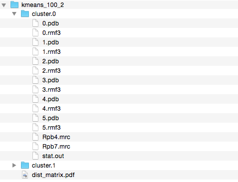
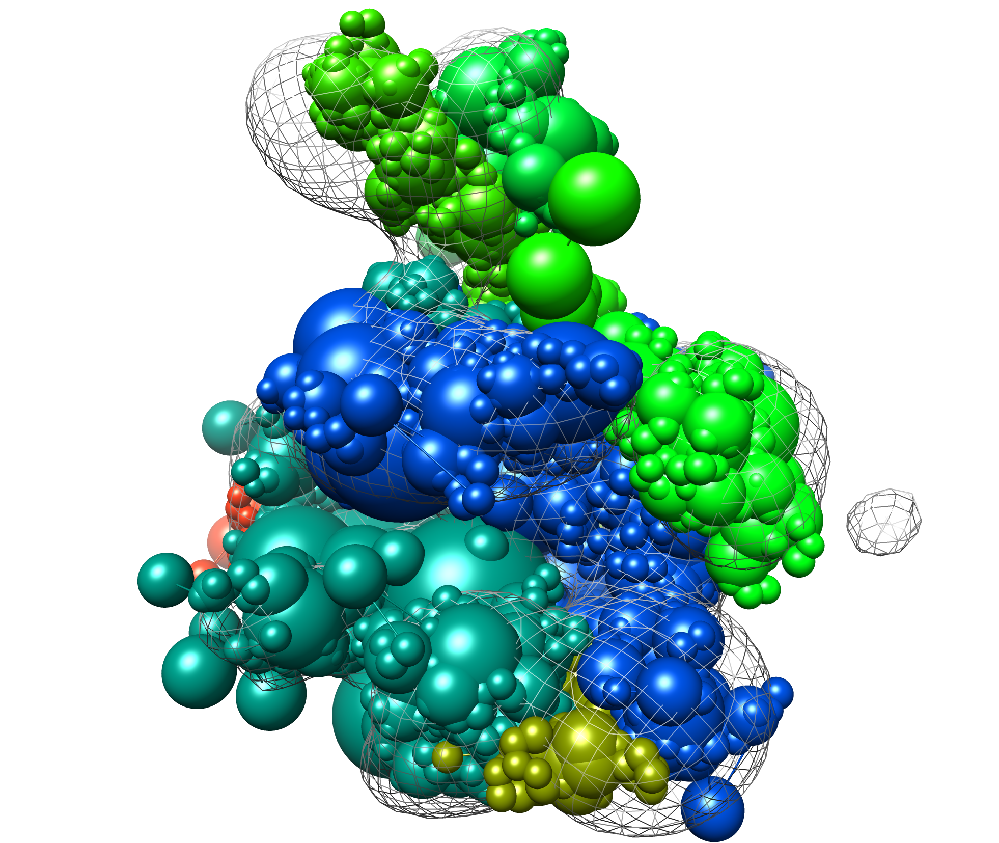
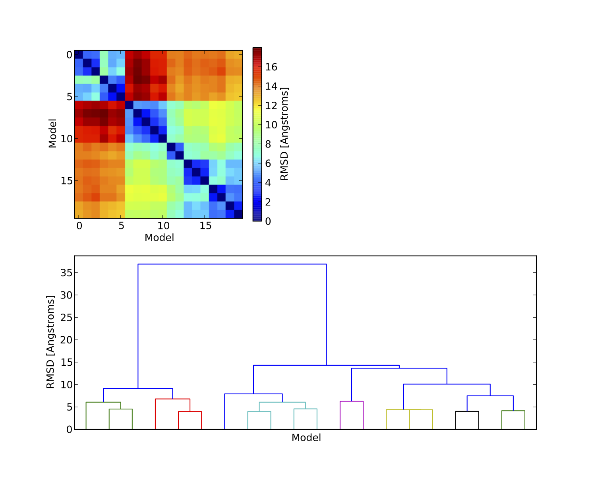
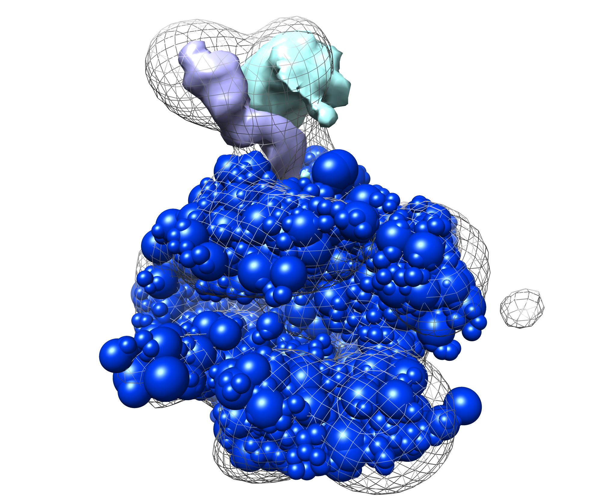

Stage 4 - Analysis Part 1 {#rnapolii_4}
=========================

### Introduction
In the analysis stage we cluster (group by similarity) the sampled models to determine high-probability configurations. Comparing clusters may indicate that there are multiple acceptable configurations given the data. 

### Precomputed results

A long modeling run was precomputed and analyzed. You can [download](ftp://salilab.org/tutorials/imp/rnapolii/results.tar.gz) it from our website, and you can [download](ftp://salilab.org/tutorials/imp/rnapolii/analysis.tar.gz) the corresponding analysis.

### Clustering top models (clustering.py)
The `clustering.py` script, found in the `rnapolii/analysis` directory, calls the [AnalysisReplicaExchange0](@ref IMP::pmi::macros::AnalysisReplicaExchange0) macro, which finds top-scoring models, extracts coordinates, runs k-means clustering, and does basic cluster analysis including creating localization densities for each subunit. The script generates a directory containing as many subdirectories as the number of clusters queried. Each subdirectory contains an RMF and a PDB for each structure extracted, a stat file, and the localization densities.

We can choose the number of clusters, the subunits we want to use to calculate the RMSD, and the number of good-scoring solutions to include. These options are at the top of the script: 

\code{.py}
num_clusters = 1                      # how many clusters to create
num_top_models = 5                    # total number of best models to analyze
merge_directories = ["../modeling/"]  # directories to analyze
prefiltervalue = 2900.0               # prefilter by score
\endcode

If we perform sampling multiple times separately, they can all be analyzed at the same time by appending to `merge_directories`. The prefiltervalue removes all models scoring below this value (meaning, they aren’t clustered) which can be helpful to reduce the problem size. 

Create the analysis macro and pass it basic information (it will search for stat files):

\code{.py}
model=IMP.Model()
mc=IMP.pmi.macros.AnalysisReplicaExchange0(model,
                                           merge_directories=merge_directories)
\endcode

These are features that are kept around (and moved to the cluster stat files):

\code{.py}
feature_list=["ISDCrossLinkMS_Distance_intrarb",
              "ISDCrossLinkMS_Distance_interrb",
              "ISDCrossLinkMS_Data_Score",
              "GaussianEMRestraint_None",
              "SimplifiedModel_Linker_Score_None",
              "ISDCrossLinkMS_Psi",
              "ISDCrossLinkMS_Sigma"]
\endcode

Now we specify the subunits (or groups or fractions of subunits) for which we want to create density localization maps. `density_names` is a dictionary, where the keys are convenient names like "Rpb1-CTD" and the values are a list of selections. The selection items can either be a domain name like "Rpb1" or a list like (200,300,"Rpb1") which means residues 200-300 of component Rpb1. This enables the user to combine multiple selections for a single density calculation.

\code{.py}
density_names = {"Rpb4":["Rpb4"],
                 "Rpb7":["Rpb7"]}
\endcode

Next, we specify the components used in calculating the RMSD between models. All selections here are used together for a single RMSD calculation between two models. The format is the same as `density_names`. One use case is when only a subset of the system is actually being sampled (with the rest kept static). Note that unless you provide something to `align_names` (see below), no alignment is done before calculating RMSD.

\code{.py}
rmsd_names = {"Rpb4":"Rpb4",
              "Rpb7":"Rpb7"}
\endcode

Next, we specify components used for structural alignment. This is needed in case there is no absolute reference frame (like an EM map). The format is the same as density and RMSD. In this case we use `None` because of the EM map.

\code{.py}
align_names = None 
\endcode

Finally, we start the clustering. Most of the options were chosen earlier in the script.

\code{.py}
mc.clustering(prefiltervalue=prefiltervalue,                   # prefilter the models by score
              number_of_best_scoring_models=num_top_models,    # number of models to be clustered
              alignment_components=None,                       # list of proteins you want to use for structural alignment
              rmsd_calculation_components=rmsd_names,          # list of proteins used to calculated the rmsd
              distance_matrix_file="distance.rawmatrix.pkl",   # save the distance matrix
              outputdir=out_dir,                               # location for clustering results
              feature_keys=feature_list,                       # extract these fields from the stat file
              load_distance_matrix_file=False,                 # skip the matrix calculation and read the precalculated matrix
              display_plot=True,                               # display the heat map plot of the distance matrix
              exit_after_display=False,                        # exit after having displayed the distance matrix plot
              get_every=1,                                     # skip structures for faster computation
              number_of_clusters=num_clusters,                 # number of clusters to be used by kmeans algorithm
              voxel_size=3.0,                                  # voxel size of the mrc files
              density_custom_ranges=density_names)             # setup the list of densities to be calculated
\endcode

### Results
Run the clustering script by changing into the `rnapolii/analysis` directory and then running:

\code{.sh}
python clustering.py
\endcode

If you ran `modeling.py` with the `--test` option, it is a good idea to give the `--test` option to `clustering.py` as well (this increases the prefilter value; none of the 50 test models generated may be good enough to satisfy the default prefilter value). With such minimal sampling, the quality of the results is unlikely to be high; you can download [the precalculated results](ftp://salilab.org/tutorials/imp/rnapolii/results.tar.gz) and the [resulting clusters](ftp://salilab.org/tutorials/imp/rnapolii/analysis.tar.gz) from our website.

First we can look through the cluster results directory to see the output (see example below). The clustering directory contains the distance matrix plot (described below) and a folder for each cluster. Within the cluster folder are PDB and RMF files containing members of each cluster, localization densities for requested components (the `.mrc` files), and a stat file output (with one entry for each cluster member). All RMF, PDB, and MRC files should be viewable in Chimera. 

Here is an example modeling result (from the provided files, `cluster.1/4.rmf3`, the cluster center):

Next we can examine the plots outputted by the clustering script. The plots are output to a single file (`dist_matrix.pdf`) in the clustering directory. The first plot is the distance matrix of the models after being grouped into clusters. The matrix should show the requested number of clusters with much lower within-cluster than between-cluster distance. If this is not the case, then perhaps too many clusters were chosen.

The second plot is a dendrogram, basically showing the distance matrix in a hierarchical way. Each vertical line from the bottom is a model, and the horizontal lines show the RMSD agreement between models. Sometimes the dendrogram can indicate a natural number of clusters, which can help determine the correct number to use. Here is the result from using 2 clusters on the example results:

Next can examine the localization densities of a cluster. These can give a qualitative idea of the precision of a cluster. Below we show results from `cluster.1` in the provided results: the native structure without Rpb4/7 (in blue), the target density map (in mesh), and the localization densities (Rpb4 in cyan, Rpb7 in purple). The localizations are quite narrow and close to the native solution:

For quantitative analysis of the clustering results we need to call another script (see [Part 2](@ref rnapolii_4_2)).
